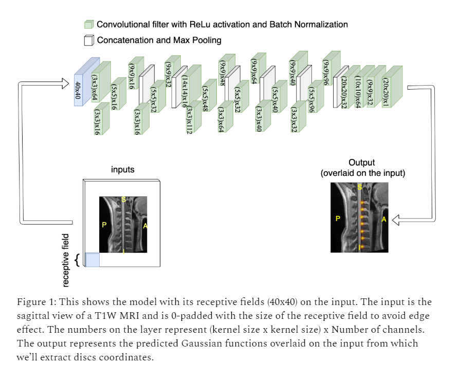
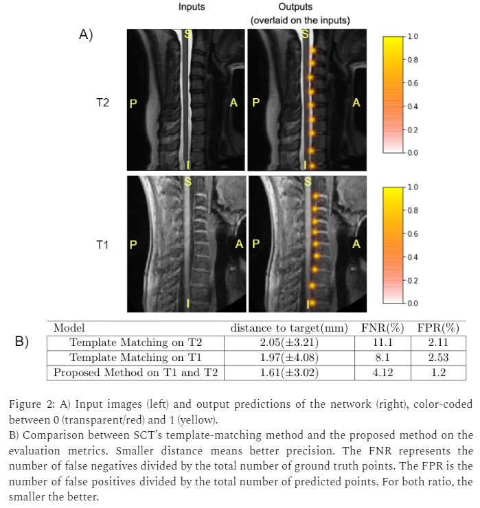

### Introduction 
Detection and labeling of intervertebral discs is useful in a clinical and academic setting to observe the progression of diseases and establish meaningful analysis, for example in spinal cord fMRI. Numerous automatic detection methods have been created to achieve this task such as template matching, which detects C2/C3 disc with a deep learning model and finds the intensity spikes representing the following discs with a sliding window (Ullmann et al., 2014) or 3D fully convolutional neural network (FCN)  (Chen et al., 2019) that segments the disc and retrieves its center coordinates. However, these methods don’t work all the time due to the variability of MR quality, contrast and resolution. The goal of this study is to adapt an FCN which was shown to work on multimodal CT images for disc segmentation and localization (Chen et al., 2019) and combine it with inception modules in order to localize and label intervertebral discs from MRI data.

### Material and method
#### Data
We used the Spinal Cord MRI Public Database (Cohen-Adad, 2019). This MRI dataset is composed of T2w and T1w data from 235 subjects, acquired by 40 different centers, thereby exhibiting “real-world” variability in terms of image quality. An average of the 6 middle slices of each subject was used as input images to the network. Ground truths were manually-created by defining a single pixel at the posterior tip of each intervertebral disc. The dataset was split into 75%, 15% and 10% for training, testing, and validation. 

#### Preprocessing
All 3D volumes were preprocessed using Spinal Cord Toolbox v4.0.1 (De Leener et al., 2017). They were resampled to 1-mm isotropic and straightened according to the spinal cord centerline (Leener et al., 2017) obtained with the spinal cord segmentation performed by SCT. As part of straightening transformation, the image was cropped to 141x141 pixels around the spinal region. A Contrast Limited Adaptive Histogram Equalization (CLAHE) algorithm was used to reduce intra-image contrast variability (Zuiderveld, 1994). Ground truths were transformed as well to improve network performances. Single-pixel labels were converted to a Gaussian function with a radius of 10 to increase target size as a way to mitigate class imbalance.

#### Processing
Our custom deep learning model based on inception modules (Szegedy et al., 2015) is shown in figure 1. It extracts several patches within each image, every pixel is therefore processed by the network several times allowing to average over the error and avoid false negatives, as it was done for counting cells in microscopic slices (Cohen et al., 2017).  We trained the network for 1000 epochs with a combination of Dice loss (Milletari et al., 2016), adaptive wing loss (Wang, Bo and Fuxin, 2019) and L2-loss (squared loss). 

#### Metrics
Predicted Gaussians were thresholded at 0.5 and the center of mass was retrieved as the predicted coordinates. The performance was evaluated based on the distance between manually labeled and predicted coordinates alongside the I-S axis as well as False positive rate (FPR) and False Negative Rate (FNR). False positives were defined as predicted points that were at least 5mm away from any ground truth points or groups of predicted points associated with the same ground truth coordinate. False negatives were counted with ground truth points at least 5mm away from any predicted points.

### Results 
Figure 2 compares our results on the validation set with the previous SCT method using template matching (Ullmann et al. 2014). The proposed model works equally well on the two contrasts improves prediction precision and reduces the number of FNR and FPR on both modalities.

### Conclusion and discussion 
This study presents a new custom architecture for detecting and labeling intervertebral discs. The method shows improvement in the robustness and precision of localization which will be tested in a real-life setting once it is integrated into the open-source SCT software.

